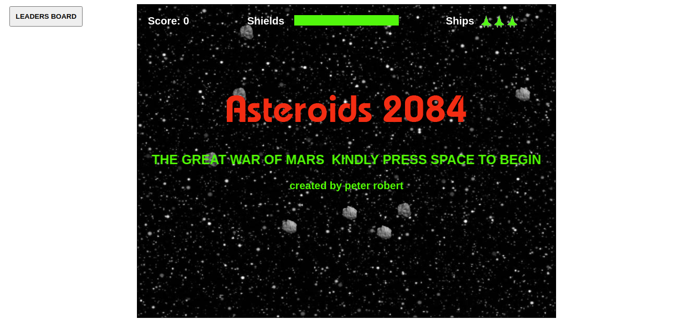

## Project Description

> This is javascript capstone project built with the Phaser 3 Game Engine.During the development process two days where all about to understanding how the game engine works and design how the game should look. Time was spent creating several assets to achieve an exceptional design. The final days consisted of building the project in order to produce a fully functional space shooter game that has different features to allow players to enjoy game play.



## Live Demo

Click [here](https://rawcdn.githack.com/peterrobert/Shooter_javascript_game/d9007089220944ed6351f964d5f1872a3e159fba/dist/index.html)

### Built With
The Game was built with the following technologies:
* Javascript
* Phaser Game Engine
* HTML
* CSS
* Webpack
* Eslint
* Stylelint
* npm


## Getting Started

### Prequesites
 * npm

### Installation

1. Clone the repo to your local machine
```
git clone https://github.com/peterrobert/Shooter_javascript_game.git
```

## Usage

2. Migrate to the cloned repository directory
```
cd shooter_javascript_game
```

3. Install all the project dependencies

```
npm install
```

4. Run the game:

NB: This will open a new tab on your browser where you will see the game or visit *localhost:3000/dist* .
```
npm start
```

## Game Play

- There are four controls for moving the ship/player:
1. using the Up, Left and Right arrow keys
  * Key Up is for moving upward
  * Key Left is for moving backwards
  * Key Right is for moving fowards

2. Use the spacebar to shoot.


## Enemies and Points rewarded after destruction

  * You need to battle up with the steroids falling from space.

## Other Future Features

> As this project open source, there are a number of features you can add, some include:

- Add Lives
- Add levels
- Add ship selection
- Add the alien base station to destroy
- Add a store


## Contributing

Contributions are what make the open source community an enviroment where developers can learn, inspire, and create great ideas. Any contributions will be highly appreciated.

1. Fork the Project
2. Create your Feature Branch (`git checkout -b feature/game_build_*feature name*`)
3. Commit your Changes
4. Push to the Branch (`git push origin feature/game_build_*feature name*`)
5. Open a Pull Request

## License

Distributed under the MIT License. See `LICENSE` for more information.


## Authors  

👤 **Peter Robert**

- Github: [@peterrobert](https://github.com/peterrobert)
- Twitter: [@ptahwambui93](https://twitter.com/Ptahwambui93)
- Linkedin: [Peter Robert Ndungu](https://www.linkedin.com/in/peter-rob-ndungu/)


## 🤝 Contributing

Contributions, issues and feature requests are welcome!. Feel free to check the [issues page](issues/).

## Show your support
